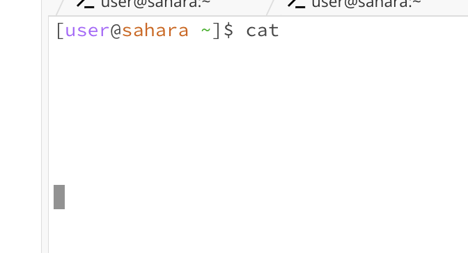
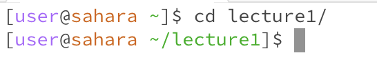
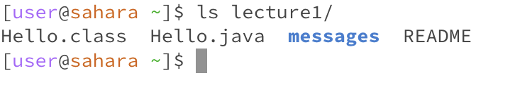
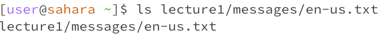

For each of the commands `cd`, `ls`, and `cat`, and using the workspace you created in this lab:

A screenshot or Markdown code block showing the command and its output
What the working directory was when the command was run
A sentence or two explaining why you got that output (e.g. what was in the filesystem, what it meant to have no arguments).
Indicate whether the output is an error or not, and if it's an error, explain why it's an error.

## **Share an example of using the command with no arguments.**
* `cd` with no argument goes to the home directory since that is the default. The output is not an error. This examples shows that the working directory was /lecture1 before the command.

* `ls` command with no argument will default to showing the names of the files of the current working directory. This working directory in this example was the home directory, so the terminal listed out the only file in that directory: "lecture1". The output didn't have an error.

* `cat` command with no argument will output an error. When this command is entered in any directory (the working directory in this example was the home directory, but this error will result no matter what the working directory is) a blank line is printed and the prompt disappears. Since the cat command displays the contents of any file(s), passing the command without an argument or specified file name, the terminal will have nothing to print. 

## **Share an example of using the command with a path to a directory as an argument.**
* `cd` command with a path to a directory as an argument will change the working directory to the specific directory. This command doesn't produce any errors. The home directory is the initial directory in both the images. By using "/" adds another step in the navigation. 
  

![Image}(PathCD.png)

* `ls`command with a path to a specific directory as an argument will list out all the files of the specified directory. The example below didn't produce an error and the argument "lecture1" displayed all the files under the lecture1 in the directory. 

* when using the `cat` command, the terminal expects a file name as the argument in order to print the contents of the argument. When the argument is instead a path to a directory, the terminal is unable to print anything. This is why the output prints "...is a directory" indicating that the argument type was incorrect. 

## **Share an example of using the command with a path to a file as an argument.**
* `cd` command with a path to a file as an argument... 
  

* `ls`:

* `cat`:

