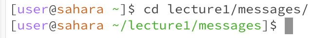

For each of the commands `cd`, `ls`, and `cat`, and using the workspace you created in this lab:

## **Share an example of using the command with no arguments.**
* `cd` with no argument goes to the home directory since that is the default. The output is not an error. This examples shows that the working directory was /lecture1 before the command.

* `ls` command with no argument will default to showing the names of the files of the current working directory. This working directory in this example was the home directory, so the terminal listed out the only file in that directory: "lecture1". The output didn't have an error.

* `cat` command with no argument will output an error. When this command is entered in any directory (the working directory in this example was the home directory, but this error will result no matter what the working directory is) a blank line is printed and the prompt disappears. Since the cat command displays the contents of any file(s), passing the command without an argument or specified file name, the terminal will have nothing to print. 

## **Share an example of using the command with a path to a directory as an argument.**
* `cd` command with a path to a directory as an argument will change the working directory to the specific directory. This command doesn't produce any errors. The home directory is the initial directory in both the images. By using "/" adds another step in the navigation. 
  

* `ls`command with a path to a specific directory as an argument will list out all the files of the specified directory. The example below didn't produce an error and the argument "lecture1" displayed all the files under the lecture1 in the directory. 

* when using the `cat` command, the terminal expects a file name as the argument in order to print the contents of the argument. When the argument is instead a path to a directory, the terminal is unable to print anything. This is why the output prints "...is a directory" indicating that the argument type was incorrect. 

## **Share an example of using the command with a path to a file as an argument.**
* `cd` command with a path to a file as an argument prints an error message, part of the message including "...not a directory." Since the `cd` command lets you change directories, the terminal expects a directory name as the argument, not a file name. When the command was run, the initial directory was the home directory. 
  

* `ls` command with a file name as an argument prints the path to the file. Although the terminal doesn't output an error message, I am going to count this output as a type of error. The `ls` command lists all the files in a specified directory, so the terminal expects a directory as an argument instead of a specific file name. The initial working directory when I ran this program was the home directory.

* The `cat` command expects a file name as an argument, so the command line successfully printed the contents of the specified file name. In this example below, the working directory was the home directory and I wanted to see contents of the en-us.txt file under the messages directory. The terminal printed "Hello World!" 

