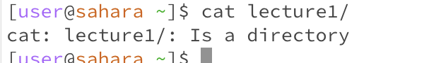

For each of the commands `cd`, `ls`, and `cat`, and using the workspace you created in this lab:

**Share an example of using the command with no arguments.**
* `cd` : with no argument goes to the home directory

* `ls` : shows the names of the files of the working directory

* `cat` : compile issue???

**Share an example of using the command with a path to a directory as an argument.**
* `cd`: with a command w/ path to directory shows...
  

* `ls`:

* `cat`:

**Share an example of using the command with a path to a file as an argument.**
* `cd`: 
  

* `ls`:

* `cat`:

