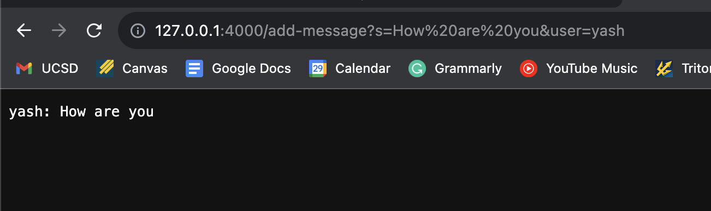
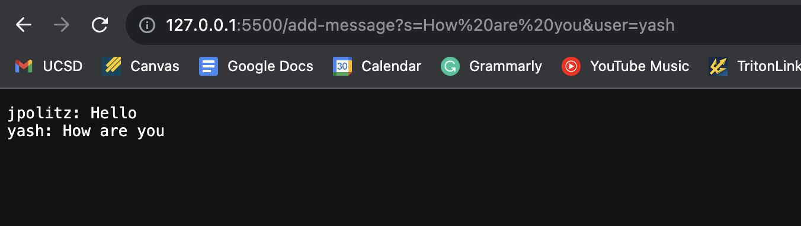
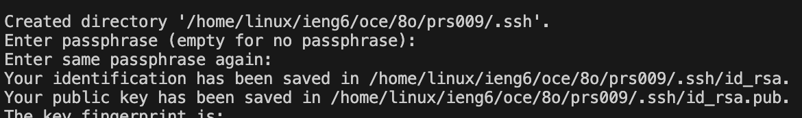
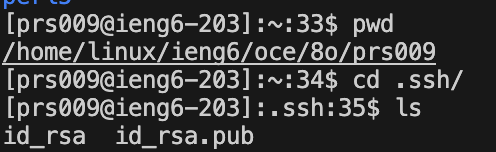

# Code for `ChatServer.java`

    import java.io.IOException;
    import java.net.URI;

    class Handler implements URLHandler {
        // The one bit of state on the server: a number that will be manipulated by
        // various requests.
        String str = "";

        public String handleRequest(URI url) {
            if (url.getPath().equals("/")) {
                return str;
            } else {
                if (url.getPath().equals("/add-message")) { 
                    String queryString = url.getQuery();
                    String[] parameters = queryString.split("&"); //split string
                    String[] messageParam = parameters[0].split("=");
                    String[] userParam = parameters[1].split("=");
                    
                    if(messageParam[0].equals("s") && userParam[0].equals("user")){
                        str += userParam[1] + ": " + messageParam[1];
                        return str; 
                    }
                }
                return "Invalid argument"; 
            }
        }
    }

    class ChatServer {
        public static void main(String[] args) throws IOException {
            if(args.length == 0){
                System.out.println("Missing port number! Try any number between 1024 to 49151");
                return;
            }
    
            int port = Integer.parseInt(args[0]);
    
            Server.start(port, new Handler());
        }
    }

------------

# Part 1

* Which methods in your code are called?
* What are the relevant arguments to those methods, and the values of any relevant fields of the class?
* How do the values of any relevant fields of the class change from this specific request? If no values got changed, explain why.

* Which methods in your code are called?
* What are the relevant arguments to those methods, and the values of any relevant fields of the class?
* How do the values of any relevant fields of the class change from this specific request? If no values got changed, explain why.

# Part 2

* /home/linux/ieng6/oce/8o/prs009/.ssh/id_rsa. **--> private**
* /home/linux/ieng6/oce/8o/prs009/.ssh/id_rsa.pub. **--> public**

* **SPECIAL NOTE**: I tried multiple things, but the terminal in both VSCode and Edstem says that my password is incorrect, so permission is denied.

# Part 3
*In a couple of sentences, describe something you learned from lab in week 2 or 3 that you didn't know before.*

* I honestly didn't know what servers were and how they worked. I liked the reference of how my individual computer is the client, while the computer in the basement that I am connected to is the server. A server is the central hub that helps connect devices and get what they want.
* Before this lab I was unaware of the concept of SSH keys: the pair of keys intended to hold a secure and private connection between the client and the server. A key pair has a private key that is stored away from the public on the client, while the public key is shared with the server.
