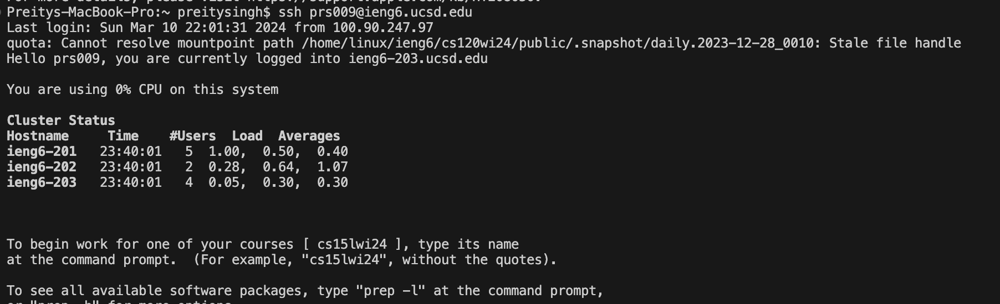
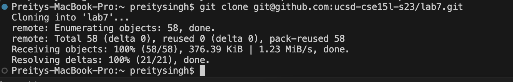
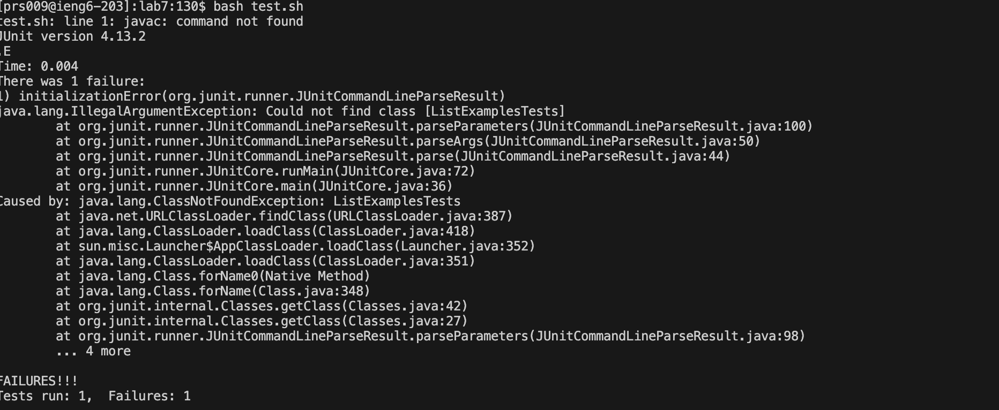
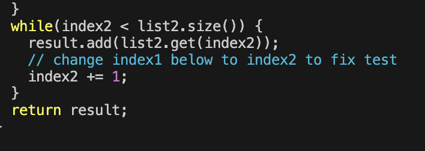
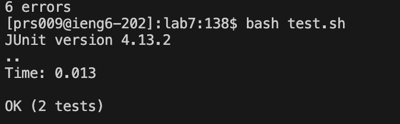
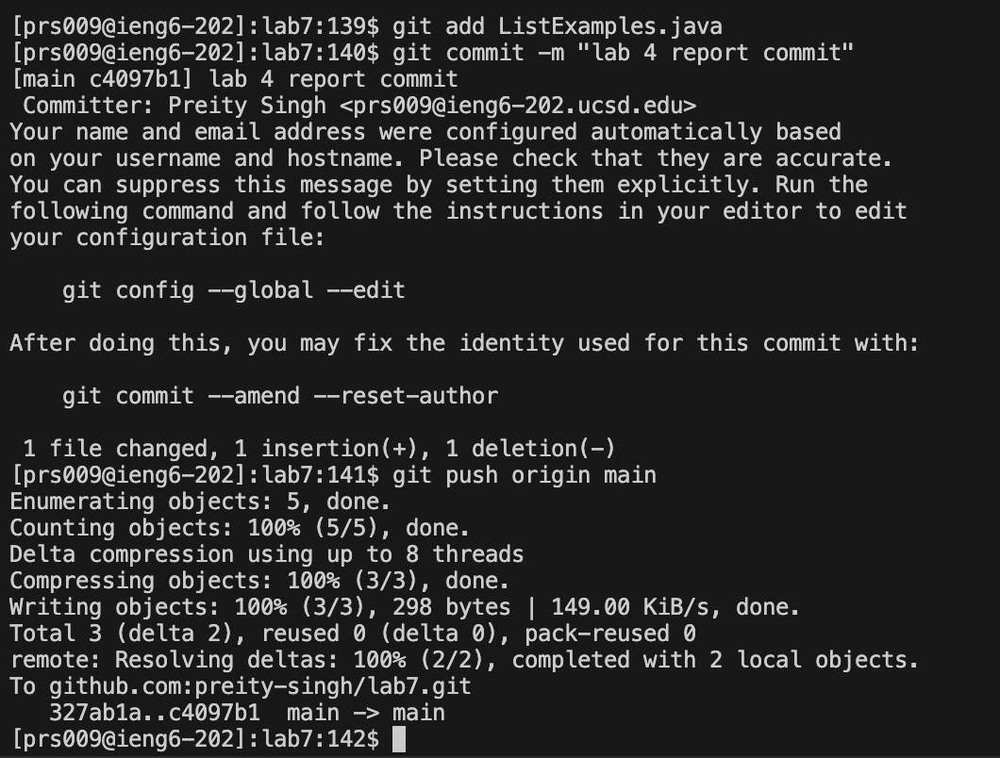

# Lab Report 4

## STEPS 4-9:

### 4: Log into ieng6
`ssh<space>prs009@ieng6.ucsd.edu<enter>`
* `ssh` - stands for "Secure Shell." Is a protocol for securely connecting to remote Git repositories. It allows me to securely authenticate and interact with the remote repository.

Then, I entered my password and was logged in. 

### 5: Clone your fork of the repository from your Github account (using the SSH URL)
My terminal didn't save for this part, and I had to relogin to ieng6, so I couldn't take a screenshot but I have the block code.

`git<space>clone<Command-V><enter>`
* `git clone` - Copies remote repository from GitHub into my local machine so I can access all the files and make edits.
* `<Command-V>` - I copied my SSH URL from my GitHub account.

### 6: Run the tests, demonstrating that they fail
`cd<space>l<tab><enter>`
* cd into the lab7 directory

`bash<space>test.sh<enter>`
* `bash` - executes the Bash shell and allows me to execute shell scripts directly from the command line.
* `test.sh` - script contain commands for testing and allows me to test `ListExamples.java`

### 7: Edit the code file to fix the failing test
`vim<space>ListExamples.java<enter>`
* `vim` command to launch the Vim editor. Allows me to efficiently edit any files.
* `ListExamples.java` name of the file I want to open in Vim. 

`44Gexi2<esc>:wq<enter>`
* `44G` - `44` refers to the line number while the `G` command moves the cursor to the specific line.
* `e` - cursor goes to the end of the first word
* `x` - this command deletes the character under the cursor
* `i` - goes into insert mode
* `2` - charactrer inserted before cursor
* `<esc>` - exists insert mode and goes back to normal mode
* `:wq` - `w` saves the changes made and `q` quits Vim

### 8: Run the tests, demonstrating that they now succeed
 `<up><up><enter>`
 * accessing my bash history to when I entered `bash test.sh` to initally run the tests before the change.

### 9: Commit and push the resulting change to your Github account (you can pick any commit message!)
`git<space>add<space>List<tab><enter>`
* `git add` - tells Git to include the changes made in the next commit
* `List<tab>` - I wanted to use a shortcut to get the `ListExamples.java` file, so I used `<tab>` to trigger the file name autocompletion.

`git<space>commit<space>-m<space>"lab 4 report commit"<enter>`
* `git commit` - This creates a new commit with the changes that have been staged.
* `-m` - When you want to insert a message to specify what the commit is

`git<space>push<space>origin<space>main<enter>`
* `git push` - push changes from my local repository to a remote repository.
* `origin` - name of the remote repository
* `main` - name of the branch I pushed. Represents the primary branch.

