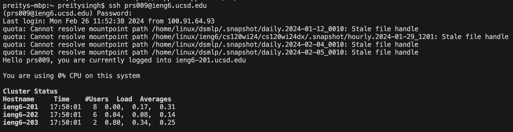

For the lab report this week, reproduce the task from above on your own. For each numbered step starting right after the timer (so steps 4-9), take a screenshot, and write down exactly **which keys you pressed to get to that step.** For special characters like <enter> or <tab>, write them in angle brackets with code formatting. Then, summarize the commands you ran and what the **effect of those keypresses were.**

For example, when you run the tests, you might want to use the **up arrow or Ctrl-R** to access your bash history rather than typing in the full command with classpath, etc. You might say something like this accompanying the screenshot for running the tests:

Keys pressed: <up><up><up><up><enter>, <up><up><up><up><enter> The javac -cp .:lib/hamcrest-core-1.3.jar:lib/junit-4.13.2.jar *.java command was 4 up in the search history, so I used up arrow to access it. Then the java -cp .:lib/hamcrest-core-1.3.jar:lib/junit-4.13.2.jar org.junit.runner.JUnitCore ... command was 4 up in the history, so I accessed and ran it in the same way.

STEPS 4-9:
### 4: Log into ieng6
* `ssh prs009@ieng6.ucsd.edu <enter>`
* entered password


### 5: Clone your fork of the repository from your Github account (using the SSH URL)
* My terminal didn't save for this part, so I couldn't take a screenshot but I have the block code. Also, for reference, I copied my ssh url from GitHub.
```
git clone <command-V> <enter>
```

### 6: Run the tests, demonstrating that they fail
* `bash test.sh <enter>`


### 7: Edit the code file to fix the failing test
* `vim ListExamples.java <enter>`
* `44G-e-x-i2-<esc>-:wq-<enter>`


### 8: Run the tests, demonstrating that they now succeed
* `<up><up><enter>`


### 9: Commit and push the resulting change to your Github account (you can pick any commit message!)
* `git add List<tab><enter>
* `git commit -m "lab 4 report commit"<enter>`
* `git push origin main<enter>`
