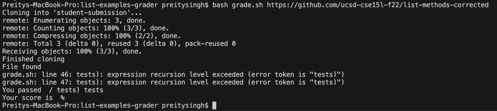
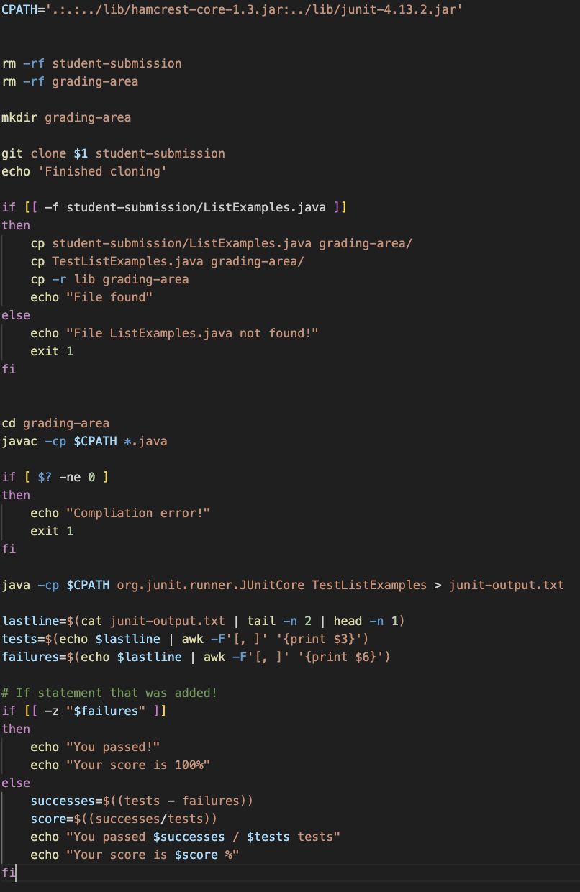

# Part 1 - Debugging Scenario
Design a debugging scenario, and write your report as a conversation on EdStem. It should have:

```
Hello! I am working on my Grade Server and am trying to run the grade.sh file. I will copy the terminal results I am getting, but it seems to output a skeleton version of the correct response. I wonder if I have correctly written the print statement in my grade.sh file.
```


```
Hi. Yes you are correct with your guess, you might want to consider the case when $failures is empty. (Hint! What can an if-else statement do?)
```



```
There aren't supposed to be any failures and the "student" is supposed to receive an 100% in this test I made. This means that there were no failure messages that were added to $failures. This is an edge case I needed to consider.
```
# Part 2 – Reflection

* One of the most valuable lessons I learned in the second half of this quarter was Jupyter Development Platform (JDP). Learning about JDP and its user-friendly interface for coding and documentation was eye-opening for me. JDP is probably one of the most beneficial tools we learned in this software tools course and I plan on using it during the debugging process in my future CS courses, but also in my future career as a software developer.
