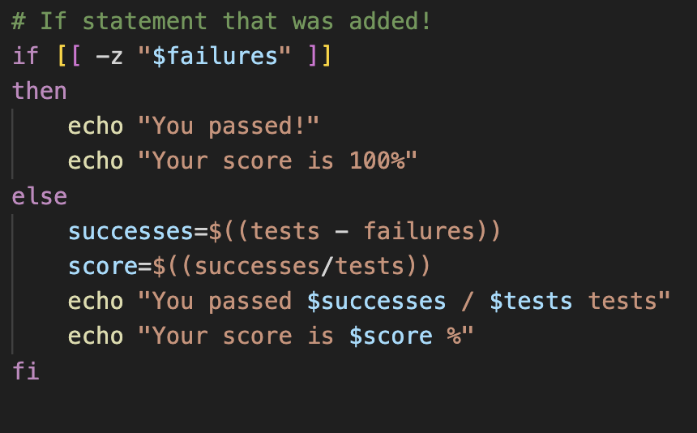
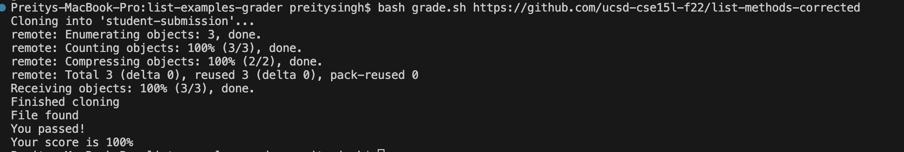

# Part 1 - Debugging Scenario
```
Student: Hello! I am working on my Grade Server and am trying to run the grade.sh file.
I will copy the terminal results I am getting, but it seems to output a skeleton
version of the correct response. I wonder if I have correctly written the print
statement in my grade.sh file.
```


```
TA: Hi. Yes you are correct with your guess, you might want to consider the case
when $failures is empty. (Hint! What can an if-else statement do?)
```
* What the student added to their `grade.sh` to take care of the edge case.


* The file & directory structure needed
  * `List-examples-grader` directory
   * Main files talked about for this example include: `grade.sh` & `TestListExamples.java`

* The contents of each file **before** fixing the bug
### grade.sh
```
CPATH='.:.:../lib/hamcrest-core-1.3.jar:../lib/junit-4.13.2.jar'


rm -rf student-submission
rm -rf grading-area

mkdir grading-area

git clone $1 student-submission
echo 'Finished cloning'

if [[ -f student-submission/ListExamples.java ]]
then
    cp student-submission/ListExamples.java grading-area/
    cp TestListExamples.java grading-area/
    cp -r lib grading-area
    echo "File found"
else
    echo "File ListExamples.java not found!"
    exit 1
fi


cd grading-area
javac -cp $CPATH *.java

if [ $? -ne 0 ] 
then
    echo "Compliation error!"
    exit 1
fi

java -cp $CPATH org.junit.runner.JUnitCore TestListExamples > junit-output.txt

lastline=$(cat junit-output.txt | tail -n 2 | head -n 1)
tests=$(echo $lastline | awk -F'[, ]' '{print $3}')
failures=$(echo $lastline | awk -F'[, ]' '{print $6}')

# The edits the student made were written here! (see screenshot above)
```
### TestListExamples.java
```
import static org.junit.Assert.*;
import org.junit.*;
import java.util.Arrays;
import java.util.List;

class IsMoon implements StringChecker {
  public boolean checkString(String s) {
    return s.equalsIgnoreCase("moon");
  }
}

public class TestListExamples {
  @Test
  public void testFilter() {
    List<String> list = Arrays.asList("apple", "banana", "orange", "moon", "sun");

    StringChecker moonChecker = new IsMoon();

    List<String> filteredList = ListExamples.filter(list,moonChecker);

    assertEquals(1,filteredList.size()); //theres one moon
    assertEquals(true, filteredList.contains("moon")); //contains moon
  }

  @Test(timeout = 500)
  public void testMergeRightEnd() {
    List<String> left = Arrays.asList("a", "b", "c");
    List<String> right = Arrays.asList("a", "d");
    List<String> merged = ListExamples.merge(left, right);
    List<String> expected = Arrays.asList("a", "a", "b", "c", "d");
    assertEquals(expected, merged);
  }
}
```


* The full command line (or lines) you ran to trigger the bug
  * `bash grade.sh https://github.com/ucsd-cse15l-f22/list-methods-corrected`
  * The terminal output of this command line is pasted above in the "student" post. Below is the terminal output after the bug was fixed.
 

* A description of what to edit to fix the bug
  * There aren't supposed to be any failures. The terminal is supposed to output a
  100% or 0 bugs message after running the test I wrote in `TestListExamples.java`.
  This means that there were no failure messages that were added to `$failures`.
  However, this edge case was not considered the since there was nothing added to
  `$failures`, and `$successes` and `$tests` weren't updated, the `echo` command only printed
  the "skeleton" of the output message.

# Part 2 – Reflection

* One of the most valuable lessons I learned in the second half of this quarter was Jupyter Development Platform (JDP). Learning about JDP and its user-friendly interface for coding and documentation was eye-opening for me. JDP is probably one of the most beneficial tools we learned in this software tools course and I plan on using it during the debugging process in my future CS courses, but also in my future career as a software developer.
